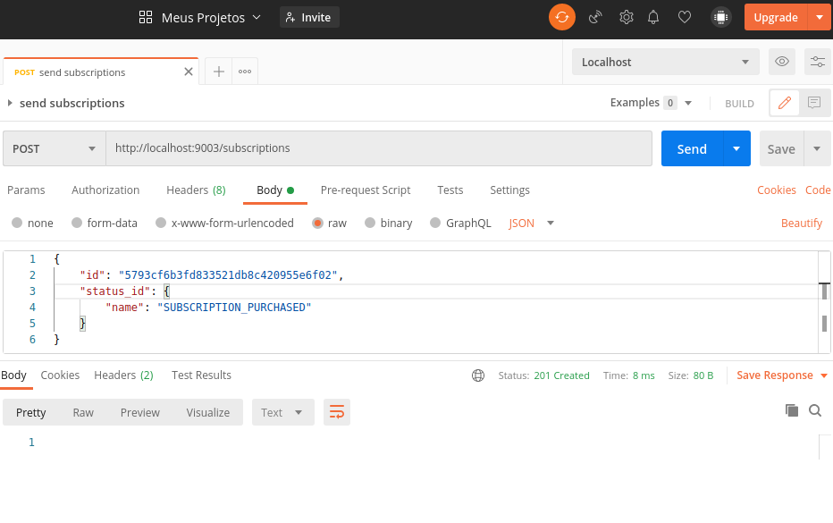
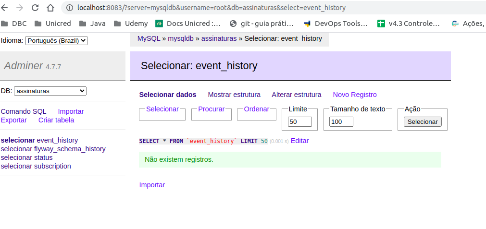
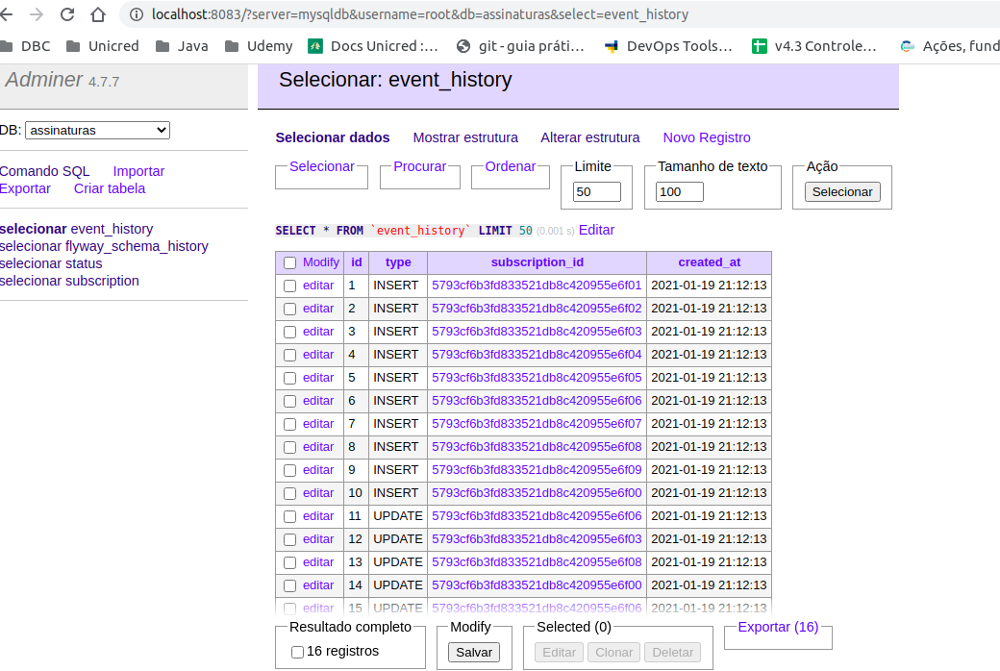

# Assinatura Globoplay

API criada para o desafio de envio de notificaçoes de assinaturas Globoplay

## Tecnologias

O projeto foi desenvolvido utilizando as seguintes tecnologias:

* Java - versão 8
* TDD com mockito
* Spring boot - 2.1.6
* Swagger  
* MySQL 
* RabbitMQ
* Flyway para versionamento do banco
* Gradle
* Docker
* Git para versionamentoda aplicação

### Docker
O Docker compose possui as seguintes imagens:
- RabbitMQ
- MySQL
- App Spring Boot

Aplicação disponível em:
```
http://localhost:9003/swagger-ui.html
```

Adminer for MySQL disponivel em:
```
http://localhost:8083/?server=mysqldb
user:root
password: admin
```

RabbitMQ disponível em:
```
http://localhost:15672/
user:guest
password: guest
```


## Guia de Instalação

Baixar o projeto no repositorio gitHub disponível em [https://github.com/jeandropercevalnt/globo-waldecleber-oliveira.git]

### Passos para executar a aplicação

Execute os seguintes comandos:
```sh
git clone https://github.com/jeandropercevalnt/globo-waldecleber-oliveira.git
cd globo-waldecleber-oliveira
docker-compose up -d --build
```

Após subir o container, as tabelas foram geradas no banco MySQL juntamente com a Queue do RabbitMQ criada. 
Para consultar o status da aplicação, execute o endereço no Postman ou diretamente no browser de sua preferencia:
```
http://localhost:9003/management/health
ou
http://localhost:9003/management/info
ou 
http://localhost:9003/management/flyway

```

### Enviando as notificações
Para enviar as notificações pra ser consumidas pelo RabbitMQ, execute os comandos a seguir:

```sh
cd globo-waldecleber-oliveira
./sendNotifications 
```


## Devenvolvimento e comentários

A seguir, apresento algumas informações e comentários sobre o projeto.

Começando pela automatização do envio de notificações do arquivo txt, utilizando shell script. O desafio ficou por conta de extrair as variáveis do arquivo e enviar via cURL. Se tivesse mais tempo, teria feito em outra linguagem ou até mesmo criado um app frontend para consultar as notificaçes que foram salvas no banco, mas acredito que a solução foi satisfatória e funcionou muito bem para o propósito.
```
    curl -X POST -H "Content-Type: application/json" -d \
      '{"id":"'$id'", "status_id": {"name": "'$status_id'"}}' "http://localhost:9003/subscriptions"; \
```


### Testando o envio de uma subscription usando os parametros a seguir: 

Testes unitários estão disponíveis na camada de Service, onde há regras de negócio.
A Maioria dos testes funcionais foram executados usando o Postman e feita a consulta diretamente no banco MySQL e no RabbitMQ.

```
curl --location --request POST 'http://localhost:9003/subscriptions' \
--header 'Content-Type: application/json' \
--data-raw '{
    "id": "5793cf6b3fd833521db8c420955e6f08",
    "status_id": {
        "name": "SUBSCRIPTION_PURCHASED"
    }
}'
```


Antes de executar o ./sendNotifications


Após a execução do script


### Flyway
O Flyway foi utilizado para construir as tabelas e realizar o versionamento das mesmas.


### Auditoria
A auditoria das notificaçes ficou por conta do uso do JPA, utilizando a anotação @EntityListener

```
@Entity
@Table(name = "subscription")
@EntityListeners(AuditSubscriptionListener.class)
public class Subscription {

...

```

```
public class AuditSubscriptionListener {

    private static final Logger LOGGER = LoggerFactory.getLogger(AuditSubscriptionListener.class);

    @PrePersist
    public void onPrePersist(Subscription subscription) {
        audit(Type.INSERT, subscription);
        LOGGER.info(String.format("Inserted subscription %s", subscription.getId()));
    }

    @PreUpdate
    public void onPreUpdate(Subscription subscription) {
        audit(Type.UPDATE, subscription);
        LOGGER.info(String.format("Updated subscription %s", subscription.getId()));
    }
```


### Tasks

- [x] Aplicação disponivel na porta 9003; (OK)
- [x] Testando o envio de uma subscription usando os parametros a seguir: (OK)
- [x] Persistindo os dados em MySQL (OK)
- [x] Realizando auditoria na tabela EventHistory através de EntityListener usando: (OK)
- [x] Enfileirar notificaçoes para ser consumidas     
- [x] Persistir dados após enviar para fila
    - Enviar dados para a fila do RabbitMQ 
    - Foi criado Auditoria através do uso de AuditListener    
- [x] Criar Docker para conteinerizar aplicação
    - Usando docker-compose
- [x] Automatizar processo de envio de notificacoes
    - Shell Script sendNotifications
